# 🏗️ Projet 02 — VPC Multi-AZ · Flask · RDS MySQL

## 📋 Description

Ce projet déploie une **infrastructure AWS production-ready** en suivant les bonnes pratiques du **AWS Well-Architected Framework**.

Une application web Python (Flask) de gestion de contacts est hébergée sur des instances **EC2** dans des **subnets publics**, et communique avec une base de données **RDS MySQL** isolée dans des **subnets privés** — le tout réparti sur **2 Availability Zones** pour la haute disponibilité.

> 💡 **C'est quoi le Multi-AZ ?** AWS possède plusieurs datacenters physiques dans chaque région, appelés Availability Zones. Déployer sur 2 AZ signifie que si l'un tombe en panne, l'autre prend le relais automatiquement — zéro interruption de service.

L'infrastructure complète est déployée via **Terraform** avec une architecture modulaire — 13 modules indépendants et réutilisables.

---

## 🏛️ Architecture

```
Internet
    │
    ▼
┌─────────────────────────────────────────────┐
│           WAF (Protection applicative)       │
│     SQLi · Common Rules · Rate Limiting      │
└─────────────────────────────────────────────┘
    │
    ▼
┌─────────────────────────────────────────────┐
│        Application Load Balancer             │
│           Internet-facing · Multi-AZ         │
└─────────────────────────────────────────────┘
         │                    │
         ▼                    ▼
┌──────────────────┐  ┌──────────────────┐
│  Subnet Public   │  │  Subnet Public   │
│     AZ-a         │  │     AZ-b         │
│  EC2 (Flask)     │  │  EC2 (Flask)     │
│  Auto Scaling    │  │  Auto Scaling    │
└──────────────────┘  └──────────────────┘
         │                    │
         ▼                    ▼
┌──────────────────┐  ┌──────────────────┐
│  Subnet Privé    │  │  Subnet Privé    │
│     AZ-a         │  │     AZ-b         │
│  RDS Primary     │  │  RDS Standby     │
│  (MySQL 8.0)     │  │  (Multi-AZ)      │
└──────────────────┘  └──────────────────┘
```

---

## ⚙️ Stack technique

| Composant | Service AWS | Détail |
|---|---|---|
| Application | EC2 t2.micro | Python Flask — Gestion de contacts |
| Base de données | RDS MySQL 8.0 | db.t3.micro · Multi-AZ · Subnet privé |
| Load Balancer | Application Load Balancer | Internet-facing · Multi-AZ |
| Scaling | Auto Scaling Group | Min 1 / Max 2 instances |
| Réseau | VPC custom | CIDR 10.0.0.0/16 · 2 AZ · pub/priv |
| Sortie internet (privé) | NAT Gateway | Subnet public AZ-a |
| Sécurité réseau | Security Groups + NACLs | Principe moindre privilège |
| Protection applicative | WAF v2 | SQLi · Common Rules · Rate Limit |
| Secrets | Secrets Manager | Credentials RDS chiffrés |
| IAM | Role EC2 + Policy | Least privilege · accès Secrets Manager |
| State backend | S3 + DynamoDB | State chiffré · verrouillage |

---

## 📁 Structure du projet

```
projet-02-vpc-multi-az/
├── main.tf                    # Chef d'orchestre — appelle tous les modules
├── variables.tf               # Variables globales du projet
├── outputs.tf                 # Outputs — URL ALB, endpoints, IDs
├── terraform.tfvars           # ⚠️ À créer toi-même (voir Configuration)
├── .gitignore                 # Fichiers sensibles exclus du repo
│
├── app/                       # Application Flask
│   ├── app.py                 # Code Python — routes, connexion RDS
│   ├── requirements.txt       # Dépendances Python
│   └── templates/
│       └── index.html         # Interface HTML/CSS
│
├── scripts/
│   └── create_backend.ps1     # Script PowerShell — crée le backend S3
│
├── actifs/
│   └── captures/              # Screenshots de démonstration
│
└── modules/                   # 13 modules Terraform indépendants
    ├── vpc/                   # VPC + DNS
    ├── subnets/               # 4 subnets (2 publics + 2 privés)
    ├── igw/                   # Internet Gateway
    ├── nat/                   # NAT Gateway + Elastic IP
    ├── route_tables/          # Route tables publique + privée
    ├── security_groups/       # SG ALB + EC2 + RDS
    ├── nacl/                  # NACLs publique + privée
    ├── secrets_manager/       # Secret RDS (username, password, dbname)
    ├── iam/                   # Role EC2 + Policy Secrets Manager
    ├── rds/                   # RDS MySQL Multi-AZ + Subnet Group
    ├── alb/                   # ALB + Target Group + Listener
    ├── ec2_asg/               # Launch Template + Auto Scaling Group
    └── waf/                   # WAF Web ACL + Association ALB
```

---

## 🛠️ Prérequis

- Compte AWS actif
- AWS CLI installé et configuré (`aws configure`)
- Terraform installé (v1.0+)
- PowerShell (pour le script de création du backend)

> 💡 **Configurer AWS CLI** : Lance `aws configure` et renseigne ton Access Key ID, Secret Access Key, région (`eu-west-3`) et format (`json`).

---

## 📥 Installation

```bash
git clone https://github.com/Jimmy-Barbier/projet-02-vpc-multi-az.git
cd projet-02-vpc-multi-az
```

---

## ⚙️ Configuration

### Étape 1 — Créer le backend Terraform

> ⚠️ **Cette étape est obligatoire avant `terraform init`**. Le bucket S3 et la table DynamoDB doivent exister avant que Terraform puisse démarrer.

Lance le script PowerShell une seule fois :

```powershell
.\scripts\create_backend.ps1
```

Ce script crée automatiquement :
- Un **bucket S3** `projet-02-terraform-state` — stocke le state file Terraform
- Une **table DynamoDB** `projet-02-terraform-locks` — verrouillage du state
- Active le **versioning** et le **chiffrement AES256** sur le bucket
- Bloque tout **accès public** au bucket

> 💡 **C'est quoi le state file ?** C'est la mémoire de Terraform — il garde la liste de toutes les ressources AWS créées. Sans lui, Terraform ne sait plus ce qui existe. Le stocker dans S3 le protège contre la perte et permet le travail en équipe.

### Étape 2 — Créer le fichier terraform.tfvars

Crée un fichier `terraform.tfvars` à la racine du projet avec tes valeurs :

```hcl
# Général
project_name = "projet-02"
env          = "dev"
owner        = "ton-nom"
aws_region   = "eu-west-3"

# Réseau
vpc_cidr             = "10.0.0.0/16"
public_subnet_cidrs  = ["10.0.1.0/24", "10.0.2.0/24"]
private_subnet_cidrs = ["10.0.3.0/24", "10.0.4.0/24"]
availability_zones   = ["eu-west-3a", "eu-west-3b"]

# EC2
instance_type = "t2.micro"
ami_id        = "ami-0f61de2873e29e866"

# RDS
db_instance_class = "db.t3.micro"
db_username       = "admin"
db_name           = "contacts_db"
```

> ⚠️ **Ne jamais committer ce fichier** — il est dans le `.gitignore`. Le mot de passe RDS est passé via variable d'environnement (voir étape suivante).

> 💡 **Pourquoi pas le mot de passe dans tfvars ?** Par sécurité — si le fichier est accidentellement poussé sur GitHub, le mot de passe serait exposé publiquement. On utilise une variable d'environnement `TF_VAR_` à la place — Terraform la détecte automatiquement.

---

## 🚀 Déploiement

```powershell
# 1. Définir le mot de passe RDS (ne jamais le mettre dans le code)
$env:TF_VAR_db_password="TonMotDePasseIci!"

# 2. Initialiser Terraform (télécharge le provider AWS + configure le backend)
terraform init

# 3. Vérifier ce qui va être créé SANS rien créer
terraform plan

# 4. Déployer l'infrastructure complète
terraform apply -auto-approve
```

> ⏱️ **Durée du déploiement** : environ 20-25 minutes — RDS Multi-AZ est la ressource la plus longue à créer (~15 min).

> 💡 **Après le déploiement**, attends 5-8 minutes supplémentaires que le `user_data` installe Flask sur l'EC2. Ensuite accède à l'app via l'URL affichée dans les outputs (`alb_dns_name`).

---

## ✅ Résultats

### 01 — terraform init
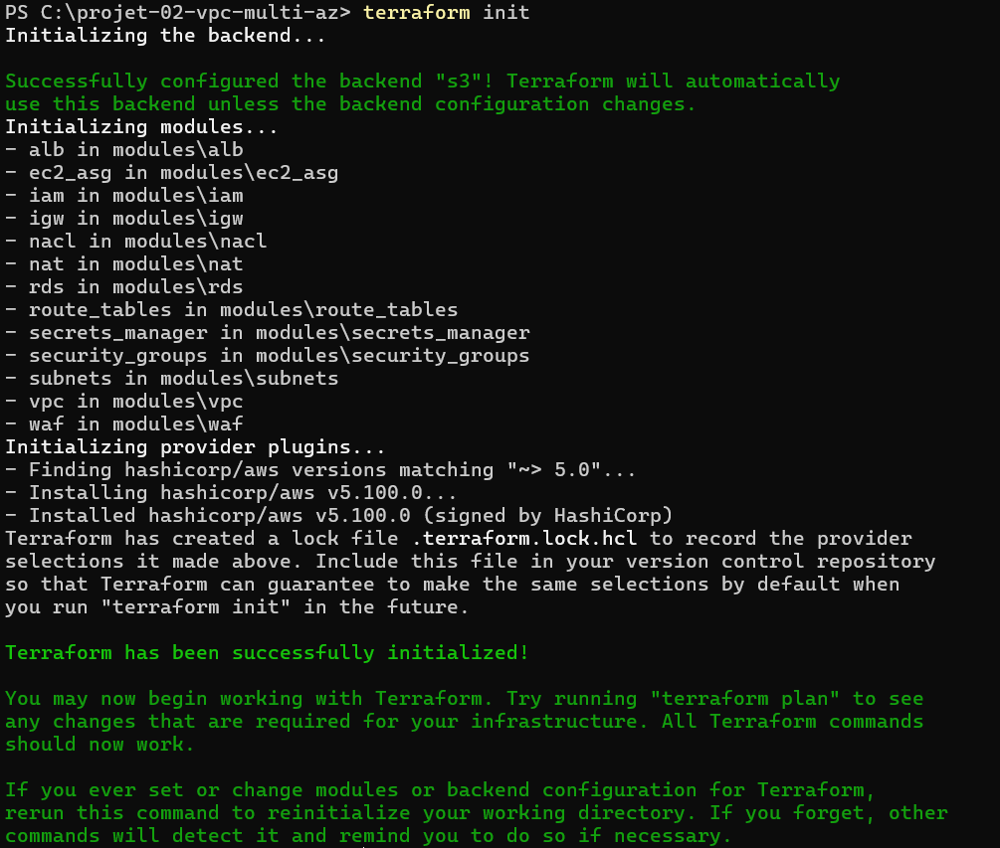

### 02 — terraform plan — 34 ressources à créer
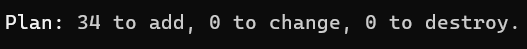

### 03 — terraform apply — Outputs finaux
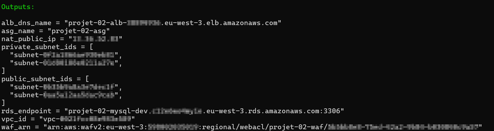

### 04 — VPC dans la console AWS
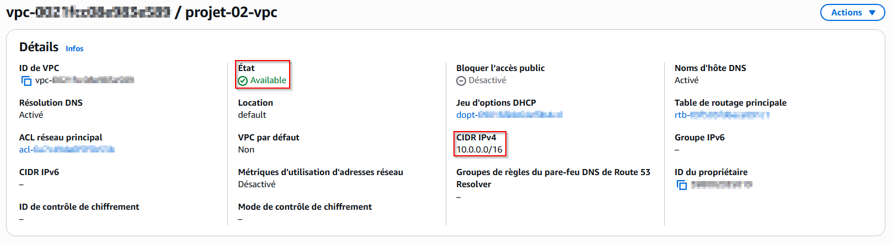

### 05 — 4 Subnets Multi-AZ (2 publics + 2 privés)
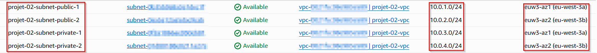

### 06 — Instance EC2 avec IAM Role attaché
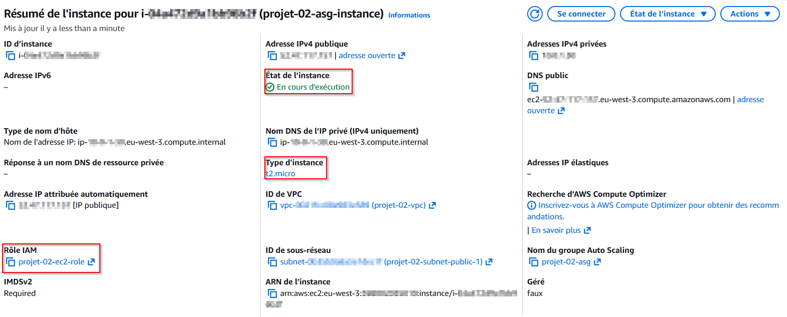

### 07 — RDS MySQL Multi-AZ — Primary AZ-b · Standby AZ-a
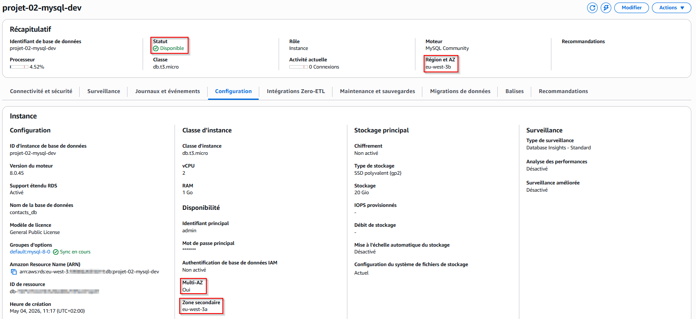

### 08 — Application Load Balancer — Internet-facing
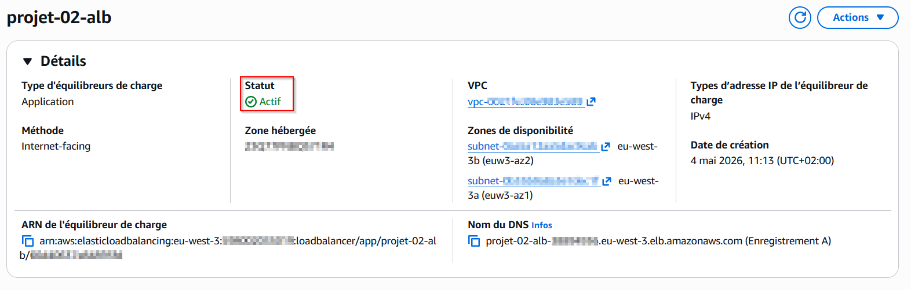

### 09 — WAF avec 3 règles de protection
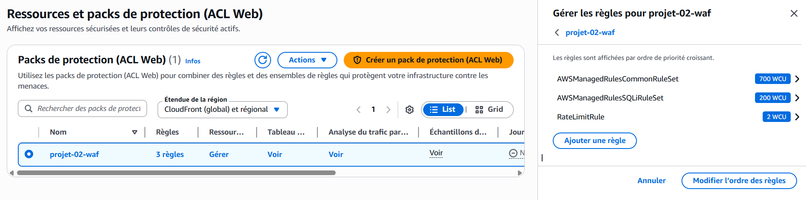

### 10 — Secrets Manager — Credentials RDS chiffrés
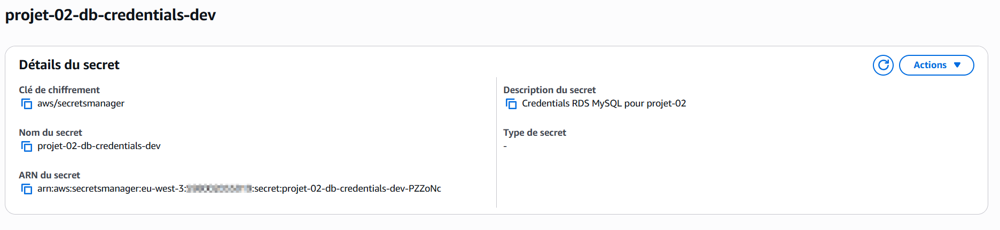

### 11 — Application Flask accessible via l'ALB
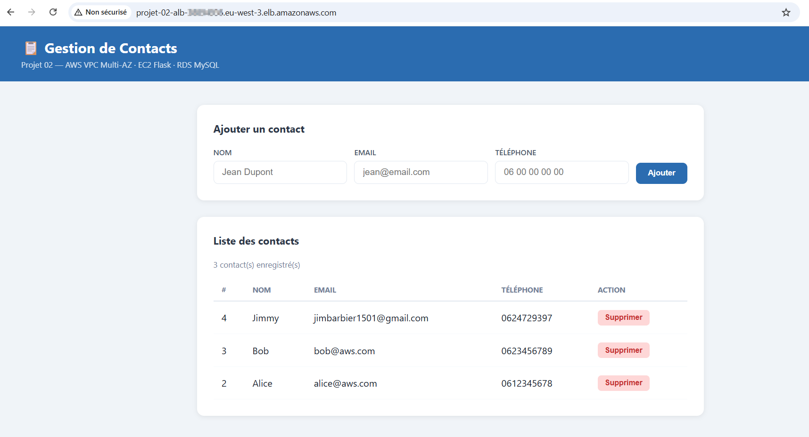

### 12 — Security Groups (ALB · EC2 · RDS)
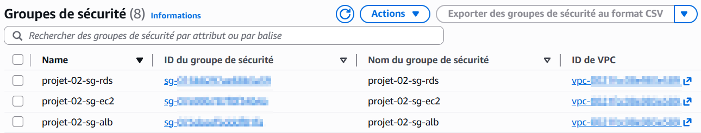

### 13 — Auto Scaling Group — Min 1 / Max 2
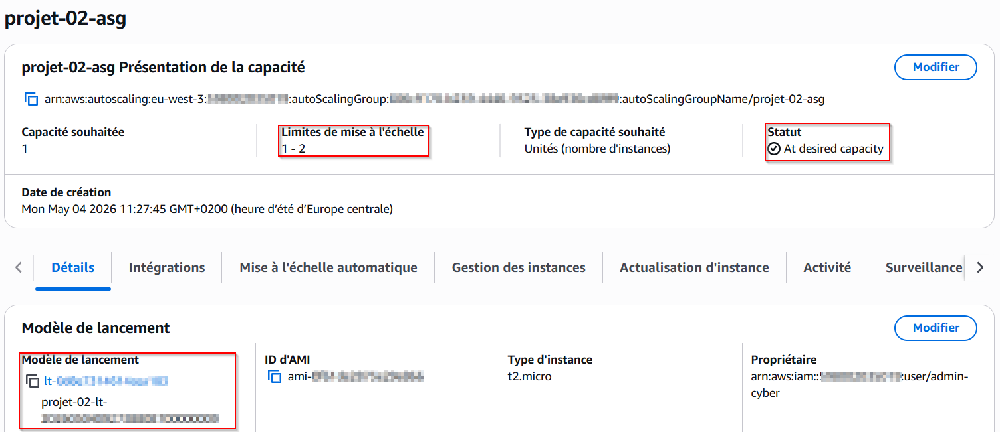

### 14 — NACLs (publique + privée)
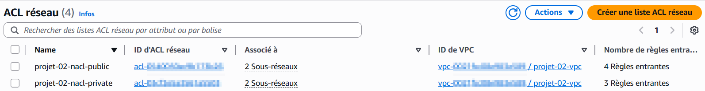

---

## 🗑️ Nettoyage

```powershell
terraform destroy -auto-approve
```

> ⚠️ Cette commande supprime **toutes** les ressources AWS créées par Terraform. Le bucket S3 et la table DynamoDB du backend sont **conservés** — ils doivent être supprimés manuellement si besoin.

```powershell
# Supprimer le backend manuellement (optionnel)
aws s3 rm s3://projet-02-terraform-state --recursive
aws s3 rb s3://projet-02-terraform-state
aws dynamodb delete-table --table-name projet-02-terraform-locks --region eu-west-3
```

---

## 🔐 Sécurité

| Composant | Mesure de sécurité |
|---|---|
| Security Groups | Trafic ALB → EC2 → RDS uniquement — jamais d'accès direct |
| NACLs | Filtrage stateless au niveau subnet — couche supplémentaire |
| WAF | Protection SQLi + Common Rules + Rate Limiting (2000 req/5min) |
| RDS | `publicly_accessible = false` — jamais exposé à Internet |
| Secrets Manager | Credentials chiffrés — jamais en dur dans le code |
| IAM Role EC2 | Least privilege — accès Secrets Manager uniquement |
| Backend S3 | Chiffré AES256 + accès public bloqué + versioning activé |

---

## 📊 Variables principales

| Nom | Description | Défaut |
|---|---|---|
| `project_name` | Nom du projet — préfixe toutes les ressources | `projet-02` |
| `env` | Environnement (dev, staging, production) | `dev` |
| `owner` | Propriétaire — tag sur toutes les ressources | — |
| `aws_region` | Région AWS | `eu-west-3` |
| `vpc_cidr` | CIDR block du VPC | `10.0.0.0/16` |
| `instance_type` | Type instance EC2 | `t2.micro` |
| `ami_id` | AMI Amazon Linux 2 — Paris | `ami-0f61de2873e29e866` |
| `db_instance_class` | Type instance RDS | `db.t3.micro` |
| `db_username` | Username base de données | `admin` |
| `db_password` | ⚠️ Via `$env:TF_VAR_db_password` uniquement | — |

---

## 📤 Outputs

| Nom | Description |
|---|---|
| `alb_dns_name` | URL de l'application — accès via navigateur |
| `vpc_id` | ID du VPC créé |
| `public_subnet_ids` | IDs des 2 subnets publics |
| `private_subnet_ids` | IDs des 2 subnets privés |
| `rds_endpoint` | Endpoint de connexion RDS |
| `nat_public_ip` | IP publique du NAT Gateway |
| `asg_name` | Nom de l'Auto Scaling Group |
| `waf_arn` | ARN du WAF Web ACL |

---

## 🗺️ Évolutions prévues

Ce projet constitue une base solide et fonctionnelle. Les améliorations suivantes sont identifiées pour une version plus complète :

**Monitoring**
- [ ] CloudWatch Alarms — alertes automatiques si CPU EC2 ou RDS dépasse 80%
- [ ] CloudWatch Logs — centralisation des logs Flask pour analyse et débogage

**Réseau**
- [ ] VPC Endpoints — accès à S3 et Secrets Manager sans passer par Internet (sécurité + coût)
- [ ] Route 53 — nom de domaine custom au lieu de l'URL générée par l'ALB

**Scalabilité**
- [ ] Autoscaling Policy — scale up/down automatique selon la charge CPU

**Sécurité**
- [ ] HTTPS — certificat SSL via AWS Certificate Manager + redirection HTTP → HTTPS

---

## 👤 Auteur

**Jimmy Barbier**
Cloud Engineer AWS en reconversion | Sécurité Cloud | Remote

[](https://www.linkedin.com/in/jimmy-barbier-89740539a/)
[](https://jimmy-barbier.github.io/portfolio/)

